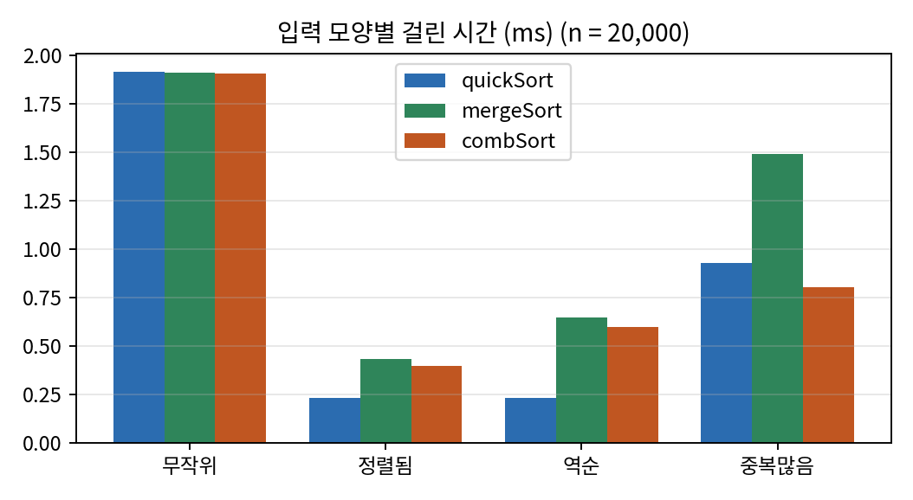
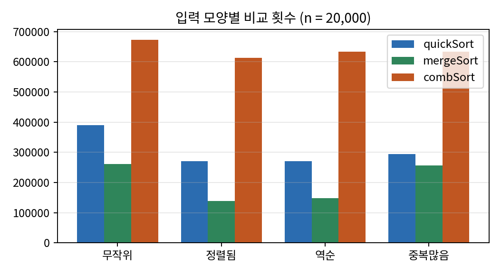
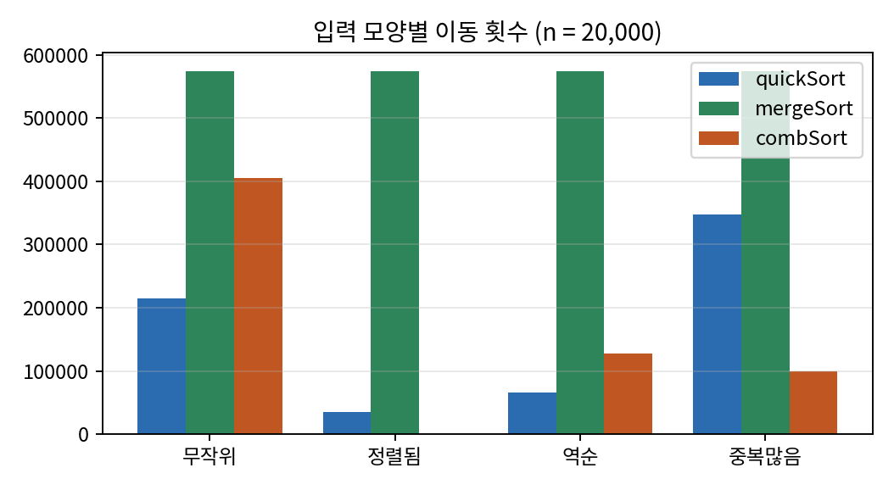
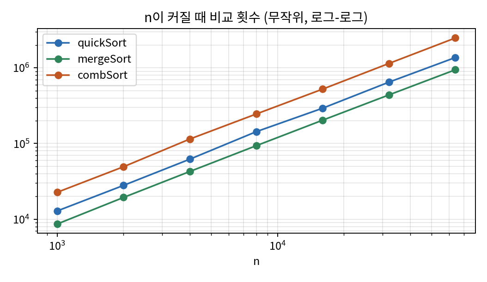
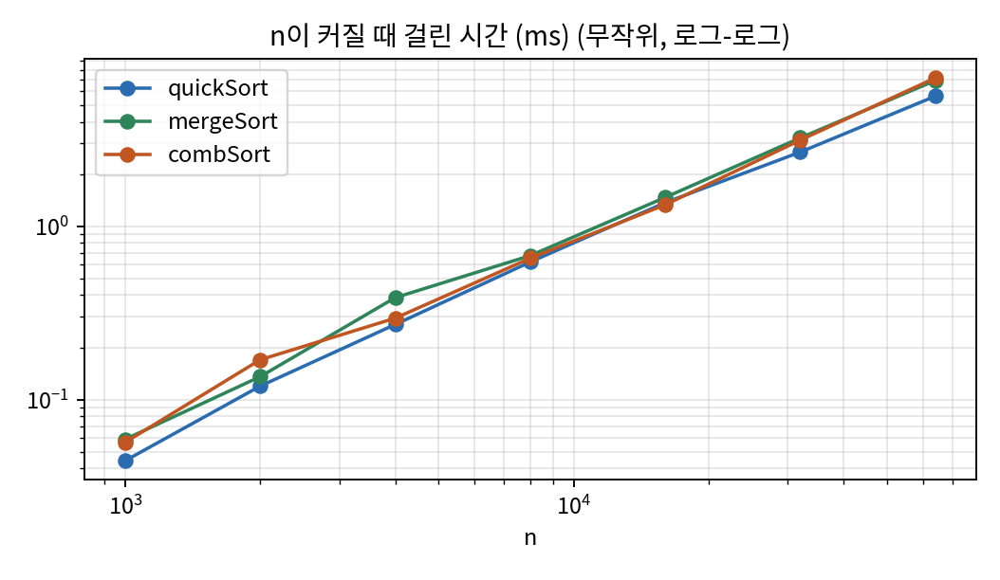

**이름** 이채훈 (2026193023) · **과목** 고급알고리즘 (SIT2001-01) · **제출일** 2026-09-30

**GitHub 저장소** <https://github.com/ch3375-dot/my-algorithm-code>

**실행** `make test` (정확성 검사) · `make run` (비교 표) · `make charts` (CSV와 그래프) — 환경: `gcc -std=c17 -Wall -Wextra -O2`

---

## 1. 무엇을 비교했나

| 구분 | 정렬 | 고른 이유 |
| --- | --- | --- |
| 배운 것 ① | **퀵 정렬** | 평균이 가장 빠르다고 알려진 제자리 정렬. 불안정 |
| 배운 것 ② | **병합 정렬** | 입력에 상관없이 `O(n log n)`이 보장되는 안정 정렬. 대신 보조 배열이 필요 |
| 배우지 않은 것 | **콤 정렬 (Comb sort)** | 버블 정렬을 한 줄 고쳐서 `O(n log n)` 가까이 끌어올린 정렬. 구현이 짧다 |

세 정렬의 성격이 서로 다른 축에 놓이도록 골랐다. 퀵은 **속도·제자리**, 병합은 **안정성·최악 보장**, 콤은 **단순함**이 강점이다. 그래서 "어느 것이 제일 빠른가"보다 "무엇을 내주고 무엇을 얻는가"를 볼 수 있다.

## 2. 코드 구성

세 정렬을 **같은 원소 타입, 같은 측정 도구**로 돌려야 비교가 공정하다. 그래서 원소를 `Rec {key, tag}`로 정했다. `key`로 정렬하고, `tag`에는 입력 순서를 새겨 둔다. 정렬이 끝난 뒤 **같은 key끼리 tag가 오름차순인지** 보면 안정성을 실제로 잴 수 있다. (`int` 배열로는 `3`과 `3`이 구별되지 않아 안정성을 볼 수 없다.)

| 파일 | 역할 |
| --- | --- |
| `src/sort.h` | `Rec`, 측정값 구조체 `Stats`, 비교·교환 매크로 `LT` `SWAP` |
| `src/quickSort.c` · `mergeSort.c` · `combSort.c` | 알고리즘 하나씩 |
| `src/main.c` | 입력 생성 · 시간/비교/이동 측정 · 정렬 여부와 안정성 검사 · 표/CSV 출력 |
| `tests/test_sort.c` | 크기 0~300 × 입력 4종을 `qsort` 결과와 대조 (4,816개 검사, 실패 0) |
| `tools/plot.py` | CSV로 그래프 작성 (matplotlib) |

측정 방법은 다음과 같다.

- **비교 횟수 / 이동 횟수**: 정렬 안에서 직접 센다. 입력을 고정 씨앗으로 만들므로 **언제 돌려도 같은 값**이 나온다. 교환 1회는 이동 3회, 병합의 복사는 1회로 셌다.
- **시간**: `clock_gettime`, 입력 복사는 빼고 5회 평균. 기계 상태에 흔들리므로 **같은 표 안에서만** 비교한다.
- **추가 메모리 / 재귀 깊이**: 입력 배열 밖에 잡은 바이트, 실제로 들어간 최대 재귀 깊이.
- **입력 4종**: 무작위 · 정렬됨 · 역순 · 중복많음(key가 0~15). 성장 실험은 무작위 입력으로 `n = 1,000 ~ 64,000`.

## 3. 알고리즘 설명

### 3.1 퀵 정렬 (배운 것)

가운데 원소를 pivot으로 잡고, pivot보다 작은 것은 왼쪽 큰 것은 오른쪽으로 나눈 뒤 양쪽을 재귀로 정렬한다. Hoare 분할을 썼고, **작은 쪽만 재귀하고 큰 쪽은 반복문으로 처리**해서 재귀 깊이를 `O(log n)`으로 묶었다. pivot을 맨 끝으로 잡으면 정렬된 입력에서 깊이가 `n`이 되어 스택이 터질 수 있기 때문이다.

- 시간: 평균 `O(n log n)`, 최악 `O(n²)` · 추가 메모리 `O(log n)`(스택) · **불안정** (멀리 떨어진 원소를 교환하므로 같은 값의 순서가 뒤바뀐다)

### 3.2 병합 정렬 (배운 것)

배열을 반으로 나눠 각각 정렬한 뒤, 두 정렬된 구간을 앞에서부터 비교하며 하나로 합친다. 같은 값이면 **왼쪽을 먼저** 꺼내므로(`if (a[j] < a[i])`의 `<`) 안정 정렬이다. 합치는 동안 결과를 둘 곳이 필요해 **보조 배열 `n`칸**을 쓴다.

- 시간: 항상 `O(n log n)` · 추가 메모리 `O(n)` · **안정**

### 3.3 콤 정렬 (배우지 않은 것 — AI로 학습)

이 절은 Claude(AI)에게 콤 정렬을 물어 학습한 내용을 정리한 것이다. (질문과 답의 요약은 6절에 붙였다.)

**배경.** 1980년 Dobosiewicz와 Borowy가 처음 설계했고, 1991년 Lacey와 Box가 다시 발견해 "Combsort"라는 이름을 붙였다(Byte 잡지). 이름은 빗살처럼 벌어진 간격으로 원소를 비교하는 모습에서 왔다. Wikipedia는 콤 정렬이 버블 정렬을 개선한 방식이 Shellsort가 삽입 정렬을 개선한 방식과 같다고 설명한다. 멀리 떨어진 원소가 교환 한 번에 여러 칸을 움직일 수 있게 하는 것이다.

**출발점: 버블 정렬의 약점.** 버블 정렬은 이웃한 원소만 교환한다. 큰 값은 한 바퀴에 끝까지 가지만(토끼), **배열 끝쪽에 있는 작은 값은 한 바퀴에 한 칸씩만 앞으로** 온다(거북이). 거북이 하나를 앞으로 보내는 데 `n`바퀴가 든다. 이것이 `O(n²)`의 주범이다.

**아이디어.** 비교하는 두 원소의 **간격(gap)** 을 처음에는 크게 잡아 거북이를 한 번에 멀리 옮기고, 간격을 매 바퀴 **1.3으로 나눠** 줄인다. 간격이 1이 되면 버블 정렬과 같지만, 그때는 배열이 이미 거의 정렬되어 있어 금방 끝난다. 줄임 비율은 Dobosiewicz가 4/3을 제안했고, Lacey와 Box가 길이 약 1,000인 무작위 배열 20만 개 이상으로 실험해 **1.3**이 좋다고 찾았다. 비율이 너무 작으면 비교가 쓸데없이 늘고, 너무 크면 거북이를 못 잡아 간격 1에서 바퀴가 많이 든다. 간격이 9나 10이 되면 11로 바꾸는 규칙(rule of 11, Combsort11)은 그 실험에서 나온 보정으로 알려져 있다.

```c
void combSort(Rec *a, int n) {
    int gap = n, swapped = 1;
    while (gap > 1 || swapped) {
        gap = gap * 10 / 13;                    /* 1.3으로 나눔 */
        if (gap == 9 || gap == 10) gap = 11;    /* rule of 11 */
        if (gap < 1) gap = 1;
        swapped = 0;
        for (int i = 0; i + gap < n; i++)
            if (LT(a[i + gap], a[i])) { SWAP(a[i], a[i + gap]); swapped = 1; }
    }
}
```

**손으로 따라가 보기** (`n = 8`, 배열 `8 4 1 5 9 2 7 3`)

| 바퀴 | gap | 교환한 쌍 | 결과 |
| --- | --- | --- | --- |
| 1 | 6 | (8,7) (4,3) | 7 3 1 5 9 2 8 4 |
| 2 | 4 | (3,2) (5,4) | 7 2 1 4 9 3 8 5 |
| 3 | 3 | (7,4) (9,5) | 4 2 1 7 5 3 8 9 |
| 4 | 2 | (4,1) (7,3) | 1 2 4 3 5 7 8 9 |
| 5 | 1 | (4,3) | 1 2 3 4 5 7 8 9 |
| 6 | 1 | 없음 → 종료 | 1 2 3 4 5 7 8 9 |

맨 뒤에 있던 작은 값 `3`이 첫 바퀴에 6칸을 뛰어 앞쪽으로 옮겨졌다((4,3) 교환). 버블 정렬이면 한 바퀴에 한 칸씩만 움직인다.

**복잡도(Wikipedia와 대조).** 최선 `Θ(n log n)`, 평균은 간격 단계 수를 `p`라 할 때 `Ω(n²/2^p)`, 최악 `O(n²)`, 추가 메모리 `O(1)`이다. 평균이 `n log n`이라고 증명된 것이 아니라 **실험에서 `n log n`에 가깝게 나온다**고 알려져 있어서 4절에서 직접 재어 확인했다. 안정성은 자료마다 적힌 것이 달라(안정이라고 적은 글도 있다) 직접 쟀고, 실측은 **불안정**이었다. 멀리 떨어진 원소를 교환하기 때문이다.

## 4. 실험 결과

### 4.1 입력 모양별 (n = 20,000)

| 입력 | 정렬 | 시간(ms) | 비교 | 이동 | 깊이 | 추가 메모리 | 안정 |
| --- | --- | ---: | ---: | ---: | ---: | ---: | :---: |
| 무작위 | quick | 1.914 | 389,601 | 214,794 | 9 | 0 | ✗ |
| 무작위 | merge | 1.913 | **260,962** | 574,464 | 15 | 160,000 B | ✓ |
| 무작위 | comb | 1.907 | 673,399 | 404,766 | 0 | 0 | ✗ |
| 정렬됨 | quick | 0.232 | 270,864 | 35,424 | 13 | 0 | – |
| 정렬됨 | merge | 0.434 | **139,216** | 574,464 | 15 | 160,000 B | – |
| 정렬됨 | comb | 0.398 | 613,402 | **0** | 0 | 0 | – |
| 역순 | quick | 0.232 | 270,878 | 65,424 | 13 | 0 | – |
| 역순 | merge | 0.649 | **148,016** | 574,464 | 15 | 160,000 B | – |
| 역순 | comb | 0.601 | 633,401 | 127,902 | 0 | 0 | – |
| 중복많음 | quick | 0.930 | 294,333 | 347,184 | 12 | 0 | ✗ |
| 중복많음 | merge | 1.494 | **255,717** | 574,464 | 15 | 160,000 B | ✓ |
| 중복많음 | comb | 0.803 | 633,401 | 99,456 | 0 | 0 | ✗ |

*안정 열의 `–`는 정렬됨·역순 입력에서 key가 모두 달라 안정성을 판정할 수 없다는 뜻이다. 안정성은 key가 겹치는 무작위·중복많음 입력에서만 의미가 있다.*

{width=78%}

{width=78%}

{width=78%}

**읽은 것**

1. **무작위에서는 시간이 셋 다 거의 같다(약 1.9ms).** 그런데 세부는 크게 다르다. 병합은 비교가 가장 적고(26만), 퀵은 이동이 가장 적고(21만), 콤은 비교가 퀵의 1.7배(67만)다. 비교를 많이 하는 대신 콤의 반복문이 단순하고 메모리를 앞에서부터 순서대로 훑어서 시간 차가 줄어든 것으로 **추정**한다(이 부분은 캐시 측정을 하지 않아 확인하지 못했다).
2. **병합은 입력을 타지 않는다.** 이동이 574,464로 네 입력에서 모두 같다. 이미 정렬된 입력이어도 배열을 통째로 복사하기 때문이다. 정렬됨·역순에서 병합이 퀵보다 느린(0.43~0.65 대 0.23ms) 이유가 이것이다.
3. **퀵은 가운데 pivot 덕에 정렬됨·역순에서도 빠르다.** 맨 끝을 pivot으로 잡았다면 이 두 입력이 `O(n²)` 최악이었을 것이다. 다만 최악 입력을 만들 수는 있으므로 `O(n²)` 가능성은 남아 있다.
4. **콤 정렬은 이미 정렬된 입력에서도 비교를 61만 번 한다.** 이동은 0이지만, 간격이 1이 될 때까지 모든 간격 단계를 한 바퀴씩 돌아야 하기 때문이다. 버블 정렬은 정렬된 입력에서 `n-1`번 비교로 끝나는 것과 대비된다. 콤 정렬이 얻은 것(무작위에서의 속도)의 값이다.
5. **안정성은 예측대로다.** 병합만 안정이고 퀵·콤은 중복 key에서 순서가 뒤바뀐다.

### 4.2 n을 키우며 (무작위)

| n | quick 비교 | merge 비교 | comb 비교 | quick(ms) | merge(ms) | comb(ms) |
| ---: | ---: | ---: | ---: | ---: | ---: | ---: |
| 1,000 | 12,872 | 8,654 | 22,703 | 0.044 | 0.059 | 0.057 |
| 2,000 | 28,001 | 19,408 | 49,371 | 0.120 | 0.136 | 0.170 |
| 4,000 | 62,164 | 42,773 | 114,715 | 0.271 | 0.387 | 0.295 |
| 8,000 | 143,331 | 93,573 | 245,380 | 0.622 | 0.677 | 0.654 |
| 16,000 | 292,585 | 203,199 | 522,739 | 1.368 | 1.467 | 1.330 |
| 32,000 | 646,620 | 438,598 | 1,141,400 | 2.678 | 3.234 | 3.139 |
| 64,000 | 1,366,056 | 941,167 | 2,474,732 | 5.626 | 6.928 | 7.169 |

{width=78%}

{width=78%}

로그-로그 그래프에서 기울기는 복잡도의 지수다. `n = 1,000 → 64,000` 구간에서 비교 횟수의 기울기는 **quick 1.12 · merge 1.13 · comb 1.13**이다. 같은 구간에서 `n log n`의 기울기가 약 1.11이고 `n²`이면 2이므로, **콤 정렬도 이 범위에서는 `n log n`과 구별되지 않는다.** 시간 기울기도 세 정렬이 1.15~1.16으로 거의 같다.

`n = 64,000`에서 `n log₂ n ≈ 1,022,000`을 기준으로 비교 횟수를 나누면 병합 **0.92**, 퀵 **1.34**, 콤 **2.42**배다. 병합이 이론 하한에 가깝고, 퀵은 평균 `1.39 n log₂ n`이라는 이론값과 맞으며, 콤은 상수가 퀵의 약 1.8배 크다.

### 4.3 종합

| 기준 | quick | merge | comb |
| --- | --- | --- | --- |
| 무작위 속도 (n=64,000) | **5.6ms** | 6.9ms | 7.2ms |
| 최악 보장 | `O(n²)` 가능 | **`O(n log n)`** | `O(n²)` 가능 |
| 추가 메모리 | `O(log n)` | `O(n)` (n=20,000에서 160,000 B) | **`O(1)`** |
| 안정성 | ✗ | **✓** | ✗ |
| 구현 길이 | 중간 | 중간 | **가장 짧다 (10줄)** |
| 입력 의존성 | 낮음(pivot 덕) | 이동 횟수가 입력과 무관 | 비교 횟수는 거의 일정(61~67만), 이동은 입력을 탐 |

## 5. 결론과 한계

- **속도만 보면 퀵 ≥ 병합 ≈ 콤**이지만 무작위 입력에서 차이는 작다(64,000개에서 최대 1.3배). 콤 정렬은 10줄짜리 코드로 `n log n`급 성능을 낸다는 점이 가장 흥미로웠다. 버블 정렬을 "간격 하나 추가"만으로 이만큼 개선한 것이다.
- **안정성이 필요하면 병합, 메모리가 부족하면 퀵이나 콤, 구현이 급하면 콤**이 맞다. 세 정렬 모두 다른 둘이 못 가진 것을 하나씩 갖고 있다.
- **한계.** (1) 시간은 한 기계에서 5회 평균이라 실행마다 조금 달라진다. 그래서 재현되는 비교·이동 횟수를 함께 실었다. (2) 콤 정렬의 최악 `O(n²)` 입력은 만들어 재지 않았다. (3) 퀵의 pivot은 가운데 원소 하나라 적대적 입력은 다루지 않았다. (4) 버블 정렬과의 직접 비교는 하지 않아 "콤이 버블보다 얼마나 빠른가"는 이론 설명에 그쳤다.

## 6. 부록: AI 학습 기록 (콤 정렬)

학습에는 Claude를 썼다. 주고받은 내용을 요약한다.

| 질문 | 답의 요약 |
| --- | --- |
| 콤 정렬이 뭔가? | 버블 정렬의 개선판. 비교 간격을 크게 시작해 매 바퀴 1.3으로 나눠 1까지 줄인다 |
| 왜 버블보다 빠른가? | 버블은 작은 값이 한 바퀴에 한 칸씩만 앞으로 와서(거북이) 느리다. 큰 간격이 그 값을 한 번에 멀리 옮긴다 |
| 1.3은 어디서 나왔나? | Dobosiewicz는 4/3을 제안했고, Lacey와 Box가 길이 1,000쯤인 무작위 배열 20만 개로 실험해 1.3을 골랐다. 이론적 유도가 아니다 |
| rule of 11은? | 간격이 9나 10이 되면 11로 바꾸는 보정(Combsort11). 실험에서 나온 규칙 |
| 복잡도는? | 최악 `O(n²)`, 평균은 실험적으로 `n log n`에 가깝다. 추가 메모리 `O(1)`, 불안정 |

AI의 답은 Wikipedia의 Comb sort 문서(<https://en.wikipedia.org/wiki/Comb_sort>)와 대조했고, 평균 복잡도와 안정성은 4절 실험으로 다시 확인했다.
